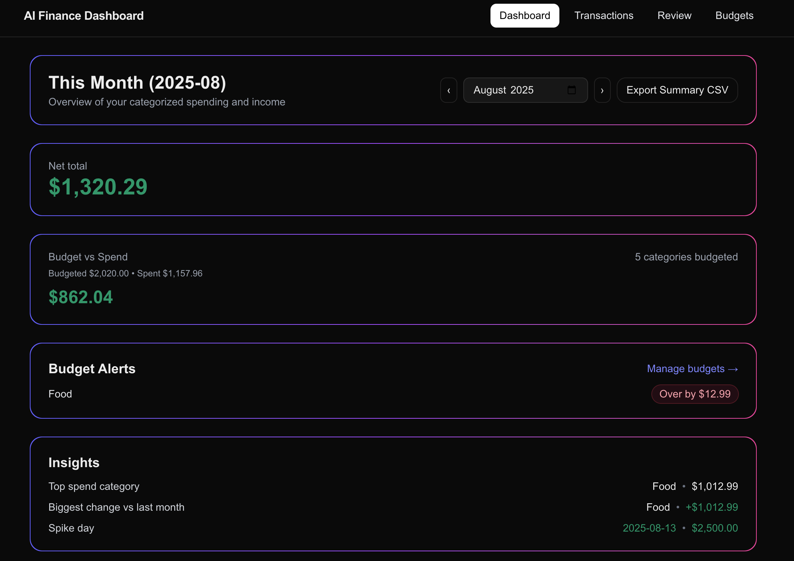
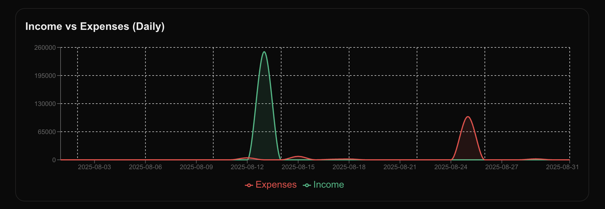
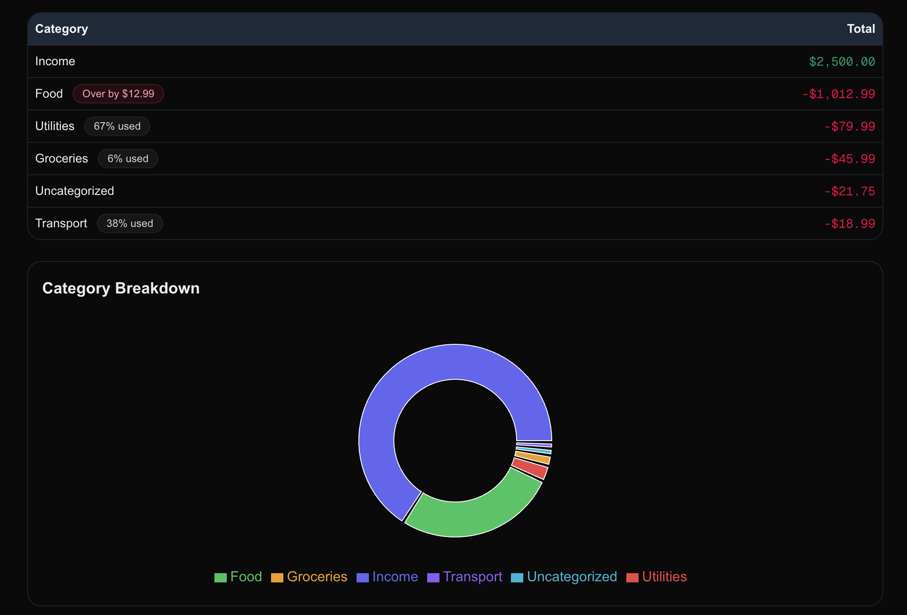
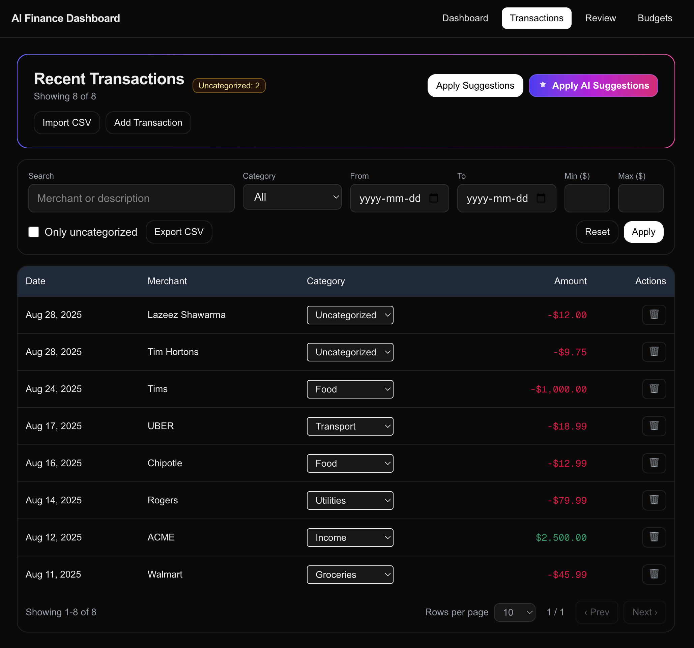
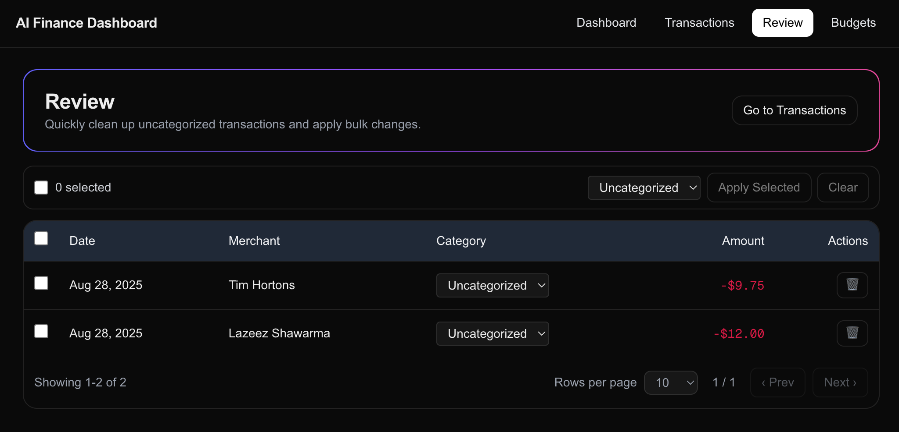
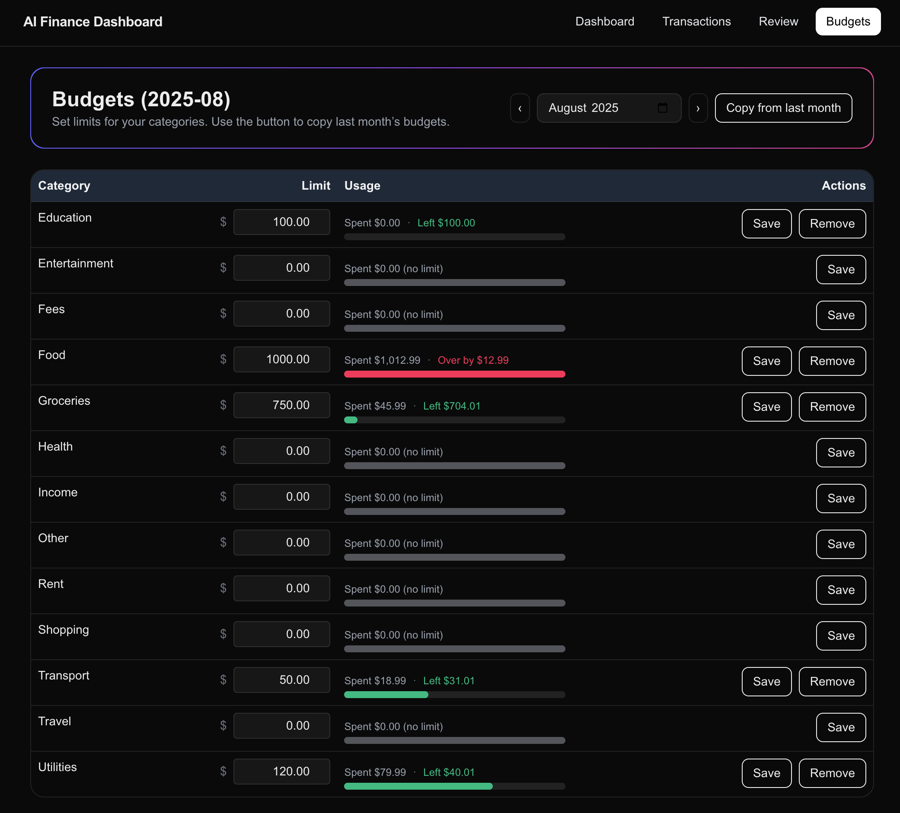

# AI Finance Dashboard (Full-Stack Next.js + TypeScript)

## Project Overview 

AI Finance Dashboard is a full-stack Next.js + TypeScript app for personal finance. Import transactions, categorize them (manually, rule-based, or via an AI endpoint), set monthly budgets, and monitor spending with clean visuals and filterable exports. The dashboard highlights net totals, trends, category breakdowns, and auto-generated insights, while the Review tab makes fixing uncategorized items fast with bulk actions.
Note: Fully dark-mode friendly out of the box.

Personal finance web app to import transactions, categorize them (rules **and AI**), review uncategorized items in bulk, set **budgets** with progress/alerts, explore **insights** and charts, and **export** filtered results to CSV.

> Built with **Next.js 15 (App Router)**, **TypeScript**, **MongoDB/Mongoose**, **Tailwind**, and lightweight charting. Optional LLM endpoints power AI categorization.

---

## ✨ Features

* **CSV Import**: Upload bank/credit card CSVs (sample included).
* **Transactions Table**:

  * Text/category/date/amount filters (server-side).
  * **Pagination** (rows per page, next/prev).
  * Inline category editing.
  * **Filter-aware Export to CSV** (exports exactly what you filtered).
* **Categorization**:

  * Rules-first manual editing.
  * **AI categorization** (preview/apply) via API endpoints (optional).
  * **Review** tab with selection, bulk apply, and pagination.
* **Budgets**:

  * Create/read/update by category & month.
  * “Spent / Left / Over” numbers with progress bars.
  * **Budget alerts** on the dashboard.
* **Dashboard**:

  * Net total, **Budget vs Spend**, **Insights** card (top category, deltas vs last month, spike day).
  * Daily income vs expenses chart.
  * Category breakdown & per-category totals with budget badges.
* **Export**:

  * CSV export respects **all active filters** (text, category, dates, amounts, uncategorized, sort).

> Note: the **To** date filter is currently treated as an **exclusive** end (e.g., filtering `2025-08-01` → `2025-08-31` returns dates `< 2025-08-31`). Choose next day (e.g., `2025-09-01`) to include the last day.

---
## 📸 Screenshots

<h3>Dashboard</h3>
<p align="center">
  <br/>
  <br/>
  
</p>

<h3>Transactions</h3>
<p align="center">
  
</p>

<h3>Review</h3>
<p align="center">
  
</p>

<h3>Budgets</h3>
<p align="center">
  
</p>

---

## 🧱 Tech Stack

* **Frontend**: Next.js (App Router), TypeScript, TailwindCSS, Recharts
* **Backend**: Next.js Route Handlers (Edge/Node)
* **Database**: MongoDB with Mongoose
* **AI**: LLM-assisted categorization & monthly insights
* **Deploy target**: Vercel (planned) + MongoDB Atlas

---

## 🗂️ Project Structure (high-level)

```
src/
  app/
    dashboard/            # main analytics view
    transactions/         # table + filters + export + pagination
    review/               # review queue with selection and bulk apply
    budgets/              # budgets CRUD + progress/usage
    import/               # CSV importer
    api/
      transactions/
        search/           # server-side filtering + pagination (JSON)
        export/           # CSV export (respects filters)
        [id]/             # per-transaction update (e.g., category)
        uncat/count/
      categorize/         # rules + AI preview/apply
      review/             # bulk apply/reject/pending/populate
      analytics/          # summary/timeseries/insights
      budgets/            # GET/PUT/DELETE, /copy
      setup/categories    # seed categories
      seed                # optional sample seed
  components/             # UI pieces (filters, tables, badges, charts)
  lib/                    # db, budgets, date, suggest, etc.
  models/                 # Mongoose models: Transaction, Category, Budget, Suggestion
```

---

Absolutely—here’s a clean, copy-pasteable **Setup** you can drop into your README. I included cloning your repo, the exact terminal commands, and optional seed steps.

---

## ⚙️ Setup

### 1) Clone the repo

```bash
# HTTPS
git clone https://github.com/7AbdUrRehman7/finance-dashboard.git
cd finance-dashboard
```

> (If you prefer SSH: `git clone git@github.com:7AbdUrRehman7/finance-dashboard.git`)

### 2) Prereqs

* Node.js **18+**
* A MongoDB connection string (e.g., MongoDB Atlas)

### 3) Environment

Create `.env.local` and fill the required values:

```bash
cp .env.example .env.local
```

**Required**

* `MONGODB_URI` — your MongoDB connection string

**Optional (if you want AI features)**

* `OPENAI_API_KEY` — for AI categorization / insights

### 4) Install & Run (Dev)

```bash
npm install
npm run dev    # http://localhost:3000
```

> If you see a Turbopack “workspace root” warning about multiple lockfiles, remove any extra `package-lock.json` outside this project folder, or set `turbopack.root` in `next.config.ts`.

### 5) Initialize Data (optional but handy)

Open these in your browser (or curl) to seed data:

* Seed default categories
  `http://localhost:3000/api/setup/categories`
* Seed sample data
  `http://localhost:3000/api/seed`

Or import your own CSV at `/import` (see `samples/` for format).

### 6) Production build (optional)

```bash
npm run build
npm start      # serves the production build
```

---

## 🔐 Environment Variables

See `.env.example` for the minimal set. For AI features, add your model provider key (e.g., `OPENAI_API_KEY`) and enable the endpoints.

---

## 🧭 Pages Overview

* **/dashboard**
  Net total, Budget vs Spend, Insights, daily trends, category tables.
* **/transactions**
  Filters (text/category/date/amount/uncategorized), **Export CSV (filtered)**, inline category edit, pagination.
* **/review**
  Shows uncategorized by default, selection checkboxes, **bulk apply**, pagination.
* **/budgets**
  Per-category monthly limits with **Spent/Left/Over** and progress bars; copy last month’s budgets.
* **/import**
  CSV importer (maps your file to `Transaction` schema).

---

## 📤 API (selected)

### `GET /api/transactions/search`

Server-side filtered list (JSON).

* Query: `text, categoryId, from (YYYY-MM-DD), to (YYYY-MM-DD exclusive), min, max` (in **cents**), `onlyUncategorized`, `page`, `limit`, `sort (dateAsc|dateDesc|amountAsc|amountDesc)`
* Returns: `{ page, pageSize, total, items[] }`

### `GET /api/transactions/export`

**CSV** export that **respects the same filters** as `search`.

* Query: `text, categoryId, from, to, min, max, onlyUncategorized, sort`
* Returns CSV with: Date, Merchant, Description, Category, Amount (CAD), AmountCents, Id

### Budgets

* `GET/PUT/DELETE /api/budgets` — upsert/remove budget for `{ month, categoryId, limitCents }`
* `POST /api/budgets/copy` — copy previous month’s budgets to the current month

### Review

* `POST /api/review/apply` — bulk apply `{ ids: string[], categoryId: string|null }`
* `POST /api/review/reject` — (if used) reject a suggestion
* `GET /api/review/pending` — (if used) pending suggestions
* `POST /api/review/populate` — (if used) populate suggestions

### Analytics

* `GET /api/analytics/summary` — totals for the dashboard
* `GET /api/analytics/timeseries` — daily points for the chart
* `GET /api/analytics/insights` — top category, deltas vs last month, spike day

### Categorization

* `POST /api/categorize/preview` — rules engine preview
* `POST /api/categorize/apply` — apply rules
* `POST /api/categorize/ai/preview` — AI preview (optional)
* `POST /api/categorize/ai/apply` — AI apply (optional)

---

## 🚀 Deployment (Vercel)

1. Push to GitHub.
2. Import the repo in Vercel.
3. Set **Environment Variables** (from `.env.local`).
4. **Build Command**: `npm run build` (Next.js 15).
5. **Start Command**: leave default.
6. Ensure MongoDB IP access list includes Vercel IPs or use SRV with user/pass.

---

## ✅ What’s Complete vs Skipped

* **Complete**: CSV import, transactions table + filters + pagination, rules/manual categorization, AI endpoints & UI actions, review queue + bulk apply + pagination, budgets CRUD + progress/alerts, dashboard charts & insights, filter-aware CSV export.
* **Intentionally Skipped**: Goals + what-if slider, cron jobs/email alerts, extensive test suite, NextAuth, polished skeleton states for every page (some exist), 404/500 pages (basic ones may exist via App Router defaults).

---

## 🧪 Tests (lightweight suggestion)

Add a few high-value tests:

* `transactions/search` date/amount filtering
* `transactions/export` honoring filters
* budget math (`Spent/Left/Over`, alert thresholds)

---

## 🙏 Acknowledgements

Inspired by real-world fintech workflows. Thanks to open-source maintainers of Next.js, Tailwind, Mongoose, and charting libs.

---

# .env.example

```env
# --- Server / DB ---
MONGODB_URI=mongodb+srv://<user>:<pass>@<cluster>/<db>?retryWrites=true&w=majority

# Optional: used by some internal URL builders (falls back to headers)
NEXT_PUBLIC_SITE_URL=http://localhost:3000

# --- AI (optional) ---
# Enable AI categorization endpoints by providing a key.
# OPENAI_API_KEY=sk-...

# --- Node/Next ---
# NODE_ENV=development
```

---

## 🔭 Future Work (nice-to-haves)

### High-impact polish (1–2 days)

* **Auth (NextAuth – Email/Google)**

  * Protect `/transactions`, `/review`, `/budgets`.
  * Add `.env`: `NEXTAUTH_URL`, `NEXTAUTH_SECRET`, and a Google OAuth client if desired.
* **Input validation (Zod)**

  * Validate all API query/body params (e.g., `/api/transactions/search`, `/api/transactions/export`).
  * Reuse schemas in both server handlers and client forms.
* **MongoDB indexes (perf)**

  * In `Transaction` model:

    ```ts
    TransactionSchema.index({ postedAt: -1 });
    TransactionSchema.index({ categoryId: 1, postedAt: -1 });
    TransactionSchema.index({ amountCents: -1, postedAt: -1 });
    TransactionSchema.index({ merchant: "text", rawDesc: "text" }); // optional
    ```
* **Insights depth**

  * Add “top merchants”, “burn rate vs last month”, and “projected month-end” tiles.

### Platform & reliability (3–5 days)

* **Cron jobs (Vercel Cron)**

  * Nightly rollup endpoint (`/api/cron/rollup`) to precompute insights.
  * Weekly/monthly budget digest, sent as email (Resend/SendGrid) or in-app notifications.
* **Testing**

  * **Unit:** Vitest for utils and API handlers.
  * **Integration/UI:** React Testing Library.
  * **E2E:** Playwright basic flows (import → categorize → review → budgets).
* **Errors & UX polish**

  * Add loading skeletons, empty states, and friendly 404/500 pages.
  * Hook Sentry (or similar) for error tracking.

### Feature stretch goals

* **Bank import integration** (Plaid or Salt Edge) to replace manual CSVs.
* **Goals & what-if** (simple slider that shows months to goal at current burn).
* **Accessibility & i18n**

  * Keyboard nav for tables, ARIA roles/labels, and optional locale/date/number formatting.
* **Export & sharing**

  * Filter-aware PDF export for dashboard (server-rendered).
* **AI enhancements**

  * Show model confidence + “why this category?” explanation.
  * Cache/combine prompts to cut latency/cost.

### Deploy notes (when ready)

* **Vercel** for web/API, **MongoDB Atlas** for DB (not Postgres).
* Document all required env vars in `.env.example`.
* Consider `dynamic = 'force-dynamic'` vs caching where appropriate.

---

